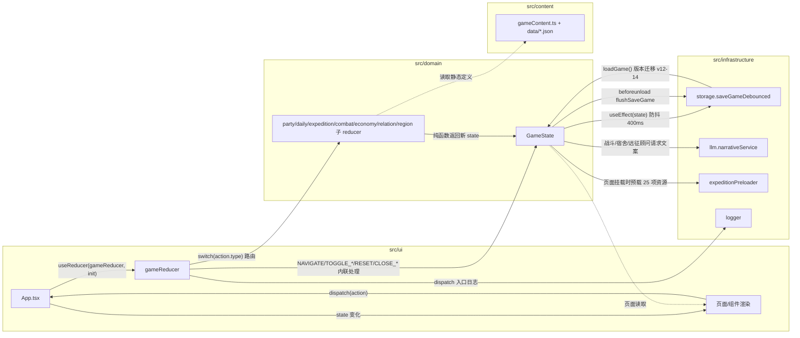

# 远征余响（expedition-echoes）架构地图

> 逐文件级架构说明，基于对 `src/` 全部源码（domain 13 文件 / content 1+5 文件 / infrastructure 5 文件 / ui 入口+6 页面+10 组件+2 样式）与根配置的完整通读。
> 本文档只描述现状，不改代码。所有路径相对项目根 `D:\projects\expedition-inn`。

---

## 1. 项目概览

### 1.1 技术栈与运行命令

| 项 | 值 |
|---|---|
| 构建 | Vite 8（`vite.config.ts`，base = `/expedition-echoes/`，含自定义 `prefixRuntimePublicAssets` 插件把运行时 `/assets/` 前缀改写为 `/${base}assets/`） |
| 框架 | React 19（`react`/`react-dom` ^19.2.8），`createRoot` + `StrictMode` |
| 语言 | TypeScript（`tsconfig.json`：strict、noUnusedLocals、moduleResolution Bundler、jsx react-jsx） |
| 战斗渲染 | Phaser 4（`phaser` ^4.0.0，仅 `src/ui/BattleCanvas.tsx` 使用，懒加载 + ErrorBoundary 隔离） |
| 测试 | Vitest 4 + jsdom + @testing-library/react（`*.test.ts(x)` 共 18 个） |
| 状态管理 | 无外部库，纯 `useReducer` + `gameReducer` 单向数据流 |
| 持久化 | `localStorage`，手动版本迁移（v12–v14） |

### 1.2 运行命令（package.json）

```jsonc
"dev": "vite",               // 本地开发
"build": "tsc -b && vite build", // 类型检查 + 构建到 dist/
"preview": "vite preview",
"test": "vitest run",
"test:watch": "vitest"
```

### 1.3 目录职责（一句话）

| 路径 | 职责 |
|---|---|
| `src/domain/` | 纯逻辑层：GameState 类型、GameAction、gameReducer 路由、7 个领域 reducer、战斗/意图/平衡常量/错误基类（零 React 依赖，可单测） |
| `src/content/` | 静态内容层：`gameContent.ts`（英雄/物品/敌人/任务/技能/事件链/新闻/台词表）+ `data/*.json` 5 个平衡数据文件 |
| `src/infrastructure/` | 外部世界适配：localStorage 存档（含版本迁移）、LLM 叙事服务（插件桥/独立 API/离线回退）、资源预载、日志 |
| `src/ui/` | 展示层：App 入口 + 6 个页面 + 10 个组件 + 2 个样式文件（`styles.css` 全局、`expedition.css` 远征专用） |
| `docs/` | 设计文档（GDD、战斗意图、区域事件等）；本文档 `ARCHITECTURE_MAP.md` 为代码现状地图 |
| `.github/workflows/deploy-pages.yml` | GitHub Pages 部署：push main 时 npm ci → build → 上传 dist → deploy-pages |
| `public/assets/` | 图片资源（世界场景、像素人偶、敌人、立绘、UI 图标） |

---

## 2. 分层架构图

依赖方向（严格单向为主，仅一处例外见 §5.5）：

```
┌─────────────────────────────────────────────────────────────┐
│  src/ui（React 组件层）                                      │
│  App.tsx ──useReducer──► gameReducer  dispatch(GameAction)   │
│  pages/* ──props(dispatch)──► components/*                  │
│  BattleCanvas.tsx（Phaser，只读 state + onAttack 回调）      │
└──────────────┬──────────────────────────────┬───────────────┘
               │ dispatch                     │ 直接调用
               ▼                              ▼
┌─────────────────────────────┐   ┌──────────────────────────────┐
│ src/domain（纯逻辑层）        │   │ src/infrastructure（适配层）   │
│ gameEngine.gameReducer ──►  │   │ storage（localStorage/迁移）   │
│  ├─ partyReducer            │   │ llm（narrativeService）        │
│  ├─ dailyReducer            │   │ api（direct LLM HTTP）         │
│  ├─ expeditionReducer       │   │ expeditionPreloader（预载）     │
│  ├─ combatReducer           │   │ logger（console 日志）          │
│  ├─ economyReducer          │   └──────────────▲───────────────┘
│  ├─ relationReducer         │                  │ import
│  └─ regionReducer           │                  │
└──────────────┬──────────────┘                  │
               │ import（只读静态数据）            │
               ▼                                 │
┌─────────────────────────────┐                  │
│ src/content（静态内容层）     │◄─────────────────┘
│ gameContent.ts + data/*.json │（llm/storage/preloader 也 import content）
└─────────────────────────────┘
```

### 数据流（App useReducer → gameReducer → 子 reducer → GameState → 页面渲染 → storage 持久化）



---

## 3. GameState 完整结构（src/domain/model.ts）

### 3.1 顶层字段与持久化标注

`GameState`（第 153–166 行）。**持久化 = storage.ts 的 `StoredGame` 会读写的字段**（storage 迁移表实际字段见 §7.1）。

| 字段 | 类型 | 持久化 | 说明 |
|---|---|---|---|
| `version` | `14`（字面量） | ✅（校验 12–14） | 存档版本号；`createInitialGame` 固定 14 |
| `page` | `Page \| 'settlement'` | ✅ | 当前页面；`Page = 'town'\|'tavern'\|'quarters'\|'management'\|'expedition'\|'settings'`（`settlement` 不在 Page 联合中，是额外并入） |
| `gold` | `number` | ✅ | 金币 |
| `roster` | `Hero[]` | ✅ | 全部英雄（含未招募） |
| `inventory` | `Record<string, number>` | ✅ | 城镇背包（物品 id → 数量） |
| `selectedHeroIds` | `string[]` | ✅ | 出征编队（≤3） |
| `selectedMissionId` | `string` | ✅ | 当前选中任务 |
| `managementTab` | `'party'\|'inventory'\|'equipment'\|'craft'` | ✅ | 管理页标签 |
| `expedition` | `Expedition \| null` | ✅（深清洗） | 进行中的远征；null 表示不在远征 |
| `settings` | `{ pressureEnabled: boolean; llmEnabled: boolean }` | ✅（兼容旧 `moraleEnabled`） | 压力系统 / LLM 开关 |
| `log` | `string[]` | ✅（slice(0,8)） | 最近 8 条日志（倒序，新在前） |
| `materials` | `MaterialInventory`（`Record<string, number>`，key `${typeId}:${rarity}`） | ✅ | 材料库存 |
| `hasAcceptedMission` | `boolean` | ✅ | 今日是否已接任务 |
| `day` | `number` | ✅ | 天数（day 1 = 2026-03-01，`dayLabel` 换算） |
| `missionAcceptedToday` | `boolean` | ✅ | 今日接任务标记（REST 重置） |
| `food` | `number` | ✅ | 城镇口粮 |
| `hunger` | `number` | ✅ | 饥饿层数 |
| `giftsGivenToday` | `Record<string, number>` | ✅ | heroId → 今日送礼次数 |
| `regions` | `Record<string, ThreatLevel>`（0–3） | ✅（旧档回退静态默认） | 区域 id → 威胁等级 |
| `eventChains` | `Record<string, EventChainState>` | ✅（缺字段回退默认） | 事件链 id → 进度 |
| `settlement` | `SettlementState \| null` | ✅ | 结算数据 |
| `dayReport` | `DayReport \| null` | ✅ | 晨报（`pending: true` 时 UI 不展示） |
| `lastExpedition` | `LastExpedition \| undefined` | ✅（v14 新增，`cleanLastExpedition`） | 最近一次远征的可引用事实 |

### 3.2 嵌套类型

```ts
interface Hero {
  id: string; name: string; heroClass: HeroClass;   // 'vanguard'|'ranger'|'mage'|'medic'
  maxHp: number; hp: number; pressure: number;      // 旧档字段为 morale，storage 兼容迁移
  gearLevel: number; level: number; experience: number;
  equipment: Partial<Record<EquipmentSlot, string>>; // slot: 'weapon'|'armor'|'accessory'
  recruited: boolean; personality: string; affinity: number; preferredGiftTags: string[];
  story?: string;
  skills: string[];   // 每英雄 ≤2 个主动技能；旧档 skillId 迁移为 skills[0]
  reactions: Record<'victory'|'retreat'|'defeated'|'idle', string>;
}

interface Enemy {
  id: string; name: string; maxHp: number; hp: number; distance: number;
  attackMinRange: number; attackMaxRange: number; damage: number;
  drops?: DropEntry[];                        // { typeId; rarity; chance }
  trait?: 'pack'|'thorns'|'spores'|'rock-armor'|'ancient-core';
  intents?: EnemyIntent[];                    // 意图池，缺省 [{type:'attack'}]
}

interface Mission {
  id: string; title: string; summary: string; difficulty: 1|2|3;
  reward: number; enemyWaves: Record<number, string[]>;  // 节点下标 → 敌人 id 列表
  materialRewards?: MaterialReward[];         // { typeId; rarity; count }
}

interface ItemDefinition {
  id: string; name: string; kind: 'consumable'|'equipment'; description: string;
  slot?: EquipmentSlot; attack?: number; defense?: number;
  allowedClasses?: HeroClass[]; rarity?: Rarity;  // Rarity = 0|1|2|3|4
}

interface Expedition {
  missionId: string; nodeIndex: number; formation: string[];
  enemies: Enemy[]; supplies: Supplies; startSupplies: Supplies;
  gainedGold: number; gainedMaterials: MaterialInventory; gainedExperience: number;
  eventResolved: boolean;
  skillUses: Record<string, boolean>;   // `${heroId}:${skillId}` 每场遭遇限 1 次
  shieldBuffs: Record<string, boolean>; // heroId → 铁壁药丸
  defendBuffs: Record<string, boolean>; // heroId → 防御姿态（每场限 1 次）
  seenEvents: string[];                 // 一次性事件（once）已见
  enemyIntents: Record<string, EnemyIntent>;  // enemyId → 预告意图
  enemyCharge: Record<string, number>;        // enemyId → 蓄力层数
  choiceHistory: string[];              // `${eventId}:${choiceId}` 选择事实
}

interface Supplies { bandage: number; sedative: number; food: number; fireBomb: number; shieldElixir: number }

interface SettlementState {
  outcome: 'victory'|'retreat'|'defeated';
  consumedSupplies: { food; bandage; sedative; fireBomb; shieldElixir }(number);
  lootGold: number; lootMaterials: MaterialInventory; gainedExperience: number;
}

interface DayReport {
  completedDay: number; outcome?: 'victory'|'retreat'|'defeated'; missionTitle?: string;
  townNews: string;
  recovery: { name: string; hp: number; pressure: number; affinity: number }[];
  reactions: { heroId: string; name: string; line: string }[];
  pending?: boolean;  // true = 结算瞬间占位晨报，UI 不展示
}

interface LastExpedition {   // v14 持久字段，次日新闻消费后清空
  outcome: 'victory'|'retreat'|'defeated'; missionId?: string;
  choices: string[];        // `${eventId}:${choiceId}`；撤退追加 `retreat-at-node-${n}`
  goldGained?: number; materialsGained?: number; nodeReached?: number;
}

interface EventChainState { currentNode: string; completed: boolean }

interface EnemyIntent {     // 敌人行动预告（读题→解题）
  type: 'attack'|'charge'|'guard'|'pressure';
  targetHint?: 'front'|'back'|'weakest';  // 缺省 front
  damage?: number; pressure?: number;
}

interface SkillDefinition { id: string; name: string; description: string;
  effect: { type: 'pressure_recovery'|'single_damage'|'all_damage'|'heal_single'; value: number } }
```

---

## 4. GameAction 动作全集（model.ts 第 167–190 行 + gameEngine.ts 路由表）

共 **32 种 action**。`gameReducer` 的 `switch` 是唯一路由权威；`default` 分支用 `never` 做穷尽性编译检查。

| # | Action type | Payload 字段 | 处理者（gameEngine.ts 行号） | 说明 |
|---|---|---|---|---|
| 1 | `NAVIGATE` | `page: Page` | 内联（L43） | 切页（town 等） |
| 2 | `OPEN_MANAGEMENT` | `tab: ManagementTab` | 内联（L48） | 进管理页并切 tab |
| 3 | `TOGGLE_PRESSURE` | — | 内联（L53） | 翻转 `settings.pressureEnabled` |
| 4 | `TOGGLE_LLM` | — | 内联（L58） | 翻转 `settings.llmEnabled` |
| 5 | `RESET` | — | 内联（L63） | `createInitialGame()` 新档 |
| 6 | `ACCEPT_MISSION` | `missionId: string` | dailyReducer（L67） | 接任务（今日限 1 次 + 事件链门控） |
| 7 | `REST_TO_NEXT_DAY` | — | dailyReducer（L68） | 休息过夜：恢复/生成晨报/清 lastExpedition |
| 8 | `ADVANCE_EVENT_CHAIN` | `chainId: string` | dailyReducer（L69） | 手动推进事件链（条件满足才推进） |
| 9 | `TOGGLE_PARTY` | `heroId: string` | partyReducer（L73） | 编入/移出（≤3 人） |
| 10 | `MOVE_PARTY` | `index: number; direction: -1\|1` | partyReducer（L74） | 调整站位 |
| 11 | `EQUIP_ITEM` | `heroId: string; itemId: string` | partyReducer（L75） | 穿装备（职业/数量校验） |
| 12 | `UNEQUIP_ITEM` | `heroId: string; slot: EquipmentSlot` | partyReducer（L76） | 卸装备 |
| 13 | `RECRUIT` | `heroId: string` | partyReducer（L77） | 招募（25 金币） |
| 14 | `UPGRADE_GEAR` | `heroId: string` | partyReducer（L78） | 装备升级（cost 递进，cap 3） |
| 15 | `ATTACK` | `heroId: string; enemyId?: string` | combatReducer（L82） | 普攻（缺省打第一个存活敌人） |
| 16 | `USE_SKILL` | `heroId: string; enemyId?: string; skillId?: string` | combatReducer（L83） | 技能（缺省用 skills[0]） |
| 17 | `USE_FIRE_BOMB` | `heroId: string; enemyId?: string` | combatReducer（L84） | 火焰瓶（固定 8 伤害） |
| 18 | `USE_SHIELD_ELIXIR` | `heroId: string` | combatReducer（L85） | 铁壁药丸（减伤 +3，本场） |
| 19 | `DEFEND` | `heroId: string` | combatReducer（L86） | 防御姿态（减伤 +4，每场限 1 次） |
| 20 | `START_EXPEDITION` | `supplies?: { food; bandage; sedative; fireBomb?; shieldElixir? }` | expeditionReducer（L90） | 开远征（行囊 cap 10） |
| 21 | `USE_BANDAGE` | `heroId: string` | expeditionReducer（L91） | 远征中绷带（消耗行囊） |
| 22 | `USE_SEDATIVE` | `heroId: string` | expeditionReducer（L92） | 远征中镇定剂（消耗行囊） |
| 23 | `RESOLVE_EVENT` | `eventId: string; choiceId: string` | expeditionReducer（L93） | 事件选择（recover/scavenge/track/...） |
| 24 | `ADVANCE` | — | expeditionReducer（L94） | 推进节点；末尾 → settleExpedition('victory') |
| 25 | `RETREAT` | — | expeditionReducer（L95） | 撤退 → settleExpedition('retreat') |
| 26 | `GIVE_GIFT` | `heroId: string; giftId: string` | relationReducer（L99） | 送礼（今日 1 次，偏好 +5 / 普通 +2） |
| 27 | `SELL_MATERIAL` | `typeId: string; rarity: Rarity; count: number` | economyReducer（L103） | 卖材料 |
| 28 | `BUY_ITEM` | `itemId: string` | economyReducer（L104） | 中央广场购买 |
| 29 | `CRAFT_ITEM` | `recipeId: string` | economyReducer（L105） | 打造装备 |
| 30 | `ESCALATE_REGION` | `regionId: string` | regionReducer（L109） | 升级区域威胁（cap 3） |
| 31 | `CLOSE_SETTLEMENT` | — | 内联（L113） | 结算页 → town，清 settlement |
| 32 | `CLOSE_DAY_REPORT` | — | 内联（L118） | 关晨报，清 dayReport |

> 注：`START_EXPEDITION` 的 `supplies` 是 `Partial` 对象，`expeditionReducer` 内逐个 `??` 兜底（food 默认 `min(2, state.food)` 等），UI 层 `ExpeditionPrepOverlay` 总是传全量 5 字段。

---

## 5. 各子 reducer 详解

### 5.1 party.ts（60 行）— 队伍编成与装备

- 处理：`TOGGLE_PARTY` / `MOVE_PARTY` / `EQUIP_ITEM` / `UNEQUIP_ITEM` / `RECRUIT` / `UPGRADE_GEAR`
- 导出：

```ts
export function partyReducer(state: GameState, action: GameAction): GameState
```

- 关键逻辑：TOGGLE_PARTY 受 `BALANCE.partyMaxSize(3)` 限制且需已招募；EQUIP_ITEM 校验职业 `allowedClasses`、槽位、`availableItemCount`；UPGRADE_GEAR 花费 `30 + gearLevel*20`、cap 3。
- 依赖：`content/gameContent`（itemById/itemDefinitions）、`shared`（addLog/editHero）、`combat`（availableItemCount）、`config`（BALANCE）。

### 5.2 daily.ts（102 行）— 每日节奏与事件链推进

- 处理：`ACCEPT_MISSION` / `REST_TO_NEXT_DAY` / `ADVANCE_EVENT_CHAIN`
- 导出：

```ts
export function advanceChainIfReady(state: GameState, chainId: string): GameState
export function onMissionSettled(state: GameState, missionId: string, outcome: 'victory'|'retreat'|'defeated'): GameState
export function dailyReducer(state: GameState, action: GameAction): GameState
```

- 事件链推进规则（advanceChainIfReady）：① 无下一节点 → 链 completed；② 下一节点有 `condition.regionId+minThreat` 且威胁不足 → 拒绝推进；③ 推进到带 `effect` 的节点时写日志（`unlock-mission` / `news-bonus` 文案）。
- REST_TO_NEXT_DAY：全员 `hp +18`（封顶 maxHp）、`pressure -16`（下限 0）、胜利时 `affinity +1`；生成 `townNews = 本地模板(newsForThreat) + 事件链 bonus + 选择事实 mention`；重置 `day+1 / missionAcceptedToday / food=5 / hunger=0 / giftsGivenToday / settlement`，`lastExpedition: undefined`（消费后清空）。
- 依赖：`content/gameContent`（missions/regions/eventChains/nextChainNode/isMissionUnlocked/activeChainNewsBonus/choiceNewsMention/dayLabel/newsForThreat）、`shared`（addLog）。

### 5.3 expedition.ts（293 行）— 远征生命周期

- 处理：`START_EXPEDITION` / `USE_BANDAGE` / `USE_SEDATIVE` / `ADVANCE` / `RESOLVE_EVENT` / `RETREAT`
- 导出：

```ts
export function expeditionReducer(state: GameState, action: GameAction): GameState
// 私有：enterNode(state, nodeIndex) 进入节点（清 skillUses/shieldBuffs/defendBuffs/enemies，吃 1 食物）；
//       rollEnemyIntents(expedition) 为每个敌人 roll 初始意图
```

- START_EXPEDITION：校验已接任务、队伍 ≥2、行囊 ≤10、库存足够；把补给从城镇扣到行囊；满血满压清零进入编队；`enterNode(0)`。
- RESOLVE_EVENT 七种 effect：`recover`（回血减压）/ `scavenge`（材料+压力）/ `track`（金币+压力）/ `aid_hero`（最虚弱者回血+其余压力）/ `bargain`（材料⇄金币双向）/ `risk_fight`（召唤 rock-lizard+ash-wolf 额外战斗）/ 穷尽 `never` 检查。支持 `consumes`（选择扣行囊补给，不足拒绝）与 `once`（seenEvents 防重）。
- ADVANCE 到节点末尾 → `settleExpedition('victory', gainedGold + mission.reward, gainedMaterials + materialRewards, gainedExperience)`。
- 依赖：`content/gameContent`（missions/nodesForMission）、`shared`（addLog/enemyById）、`economy`（addMaterials/describeMaterial/materialKey/settleExpedition）、`config`、`intents`（rollIntent）。

### 5.4 combat.ts（377 行）— 战斗结算与数值

- 处理：`ATTACK` / `USE_SKILL` / `USE_FIRE_BOMB` / `USE_SHIELD_ELIXIR` / `DEFEND`
- 导出（含 gameEngine.ts 重导出的 10 个纯函数）：

```ts
export const skillUseKey = (heroId: string, skillId: string): string            // `${heroId}:${skillId}`
export const experienceToNextLevel = (level: number): number                    // 15 + max(1,level)*15
export const enemyExperienceReward = (enemy: Enemy): number                     // 8 + ceil(maxHp/8)
export const pressureStage = (pressure: number): { name: string; tone: 'steady'|'tense'|'shaken'|'critical' }
export function gainExperience(hero: Hero, amount: number): Hero                // 循环升级，+5 maxHp/级
export function equipmentBonuses(hero: Hero): { attack: number; defense: number } // O(1) itemById
export function availableItemCount(state: GameState, itemId: string): number    // 背包数 - 装备占用数
export function canAttack(hero: Hero, enemy: Enemy, formationIndex?: number): boolean
export function attackDamage(hero: Hero, pressureEnabled: boolean, hunger?: number,
  formationIndex?: number, party?: Hero[]): number                              // 职业被动/压力/饥饿
export function enemyCanAttack(enemy: Enemy, formationIndex: number): boolean
export function combatReducer(state: GameState, action: GameAction): GameState
```

- ATTACK 完整流程：canAttack 校验 → 12% 暴击 ×1.5 → guard 减半 → rock-armor −2 → 击杀给全队经验 → 全灭则结算 → 掉落 `rollDrops` 入 gainedGold/gainedMaterials → thorns 反震压力 +4 → 存活敌人按意图 `resolveEnemyAction` → 重 roll 意图 → 先锋反击可能补刀 → 全灭结算。
- 技能：每遭遇每技能限 1 次（skillUses）；四种 effect 类型；单伤/群伤保底 `hp ≥ 1`（不绕开掉落结算）。
- 依赖：`content/gameContent`（baseAttack/itemById/skillDefinitions）、`shared`、`economy`（addMaterials/describeMaterial/rollDrops/settleExpedition）、`config`、`intents`（isGuarding/resolveEnemyAction/rollIntent）。

### 5.5 economy.ts（143 行）— 经济与远征结算

- 处理：`SELL_MATERIAL` / `BUY_ITEM` / `CRAFT_ITEM`；同时承担**结算公共逻辑**
- 导出：

```ts
export const materialKey = (typeId: string, rarity: Rarity): string                    // `${typeId}:${rarity}`
export const describeMaterial = (typeId: string, rarity: Rarity): string
export const addMaterials = (inventory: MaterialInventory, gains: { typeId; rarity; count? }[]): MaterialInventory
export const rollDrops = (enemyList: Enemy[]): { typeId: string; rarity: Rarity }[]    // 按 chance 独立结算
export function settleExpedition(state: GameState, outcome: 'victory'|'retreat'|'defeated',
  lootGold: number, lootMaterials: MaterialInventory, gainedExperience: number, logMessage: string): GameState
export function economyReducer(state: GameState, action: GameAction): GameState
```

- settleExpedition（ADVANCE/RETREAT/ATTACK 全灭三处共用）：算 consumedSupplies → 返还剩余补给 `returnExpeditionSupplies` → 发战利品 → `page:'settlement'` → 写占位 `dayReport`（pending:true）→ 失败/撤退升级区域威胁 → 写 `lastExpedition`（撤退追加 `retreat-at-node-${nodeIndex+1}`）→ `onMissionSettled` 胜利推进事件链。
- **横向依赖**：`economy → daily（onMissionSettled）`，即子 reducer 之间互相调用（gameEngine 里 daily 与 economy 是兄弟），这是领域层唯一跨 reducer 依赖，值得注意。
- 依赖：`content/gameContent`（craftingRecipes/giftDefinitions/itemDefinitions/marketPrices/materialName/materialSellPrices/missions/rarityNames/regions/threatMax）、`shared`、`daily`。

### 5.6 relation.ts（24 行）— 好感送礼

- 处理：`GIVE_GIFT`
- 导出：`export function relationReducer(state: GameState, action: GameAction): GameState`
- 逻辑：校验英雄/礼物/库存/今日限 1 次；`gift.tags ∩ hero.preferredGiftTags` 命中 +5 否则 +2；跨阶段时日志提示"进入「阶段名」"。
- 依赖：`content/gameContent`（affinityStage/giftDefinitions）、`shared`。

### 5.7 region.ts（23 行）— 区域威胁

- 处理：`ESCALATE_REGION`
- 导出：`export function regionReducer(state: GameState, action: GameAction): GameState`
- 逻辑：只升级不强制；`threat ≥ threatMax(3)` 拒绝；日志 `0→1→2→3`。
- 依赖：`content/gameContent`（regions/threatMax）、`shared`。

### 5.8 支撑模块

| 模块 | 行数 | 导出签名 | 说明 |
|---|---|---|---|
| `shared.ts` | 27 | `enemyById(id: string): Enemy`；`addLog(state, message): GameState`（log 前插、slice(0,8)）；`editHero(state, id, edit): GameState`；`returnExpeditionSupplies(state): GameState` | 跨 feature 工具；enemyById 找不到返回占位敌人 |
| `config.ts` | 50 | `export const BALANCE`（as const，约 30 个平衡常量） | 全部魔法数字集中点 |
| `intents.ts` | 182 | `chargeMultiplier(chargeLayers: number): number`；`rollIntent(enemy, currentIntent, charge, rng?): EnemyIntent`；`targetForIntent(party, intent, enemy): Hero \| undefined`；`enemyCanAttack(enemy, formationIndex): boolean`；`resolveEnemyAction(state, attacker, intent): GameState`；`isGuarding(_enemy, currentIntent): boolean`；`intentDescription(intent, charge, enemyName): string` | 战斗意图系统：敌人行动预告/兑现/目标选择；纯确定性规则 |
| `errors.ts` | 64 | `class GameError extends Error`（code/timestamp/details）；`class InfrastructureError extends GameError`；`class InfrastructureLlmProviderError extends InfrastructureError` | 只保留基础设施实际使用的链路；领域层异常已删除（文件头注释说明） |
| `gameEngine.ts` | 131 | `createInitialGame(): GameState`；`gameReducer(state, action): GameState`；重导出 combat 10 个纯函数 | 路由 + 入口日志 `snapshot(state)` |

---

## 6. content 数据文件结构

### 6.1 `src/content/data/heroes.json`（5 名英雄）

| 字段 | 类型 | 说明 |
|---|---|---|
| `id` | string | lan/wu/xingluo（初始 3 人 `recruited:true`）、cheng/yan（初始 `recruited:false`） |
| `name` | string | 岚/雾/星罗/澄/砚 |
| `heroClass` | 'vanguard'\|'ranger'\|'mage'\|'medic' | 岚·砚 vanguard、雾 ranger、星罗 mage、澄 medic |
| `maxHp/hp` | number | 19–35 |
| `pressure` | number | 初始 0 |
| `gearLevel/level/experience` | number | 初始 0/1/0 |
| `equipment` | object | 初始 `{}` |
| `recruited` | boolean | |
| `personality` | string | 性格描述（LLM systemPrompt 用） |
| `affinity` | number | 初始 0 |
| `preferredGiftTags` | string[] | 偏好标签（文化/贵重/饮食/自然/神秘） |
| `story` | string | 传记（管理页故事卡） |
| `skills` | string[] | 每人 2 个技能 id（见 gameContent.skillDefinitions） |
| `reactions` | `{victory, retreat, defeated, idle}` | 结算/晨报/宿舍台词 |

### 6.2 `src/content/data/enemies.json`（8 种敌人）

| 字段 | 类型 | 说明 |
|---|---|---|
| `id` | string | scout/warden/gatekeeper（遗迹）；ash-wolf/thorn-stag/spore-beast/rock-lizard/grove-guardian（森林） |
| `name` | string | |
| `maxHp/hp` | number | 20–88 |
| `distance` | number | 站位距离（1/2） |
| `attackMinRange/attackMaxRange` | number | 攻击范围 |
| `damage` | number | 基础伤害 |
| `trait?` | string | pack/thorns/spores/rock-armor/ancient-core（5 种被动） |
| `intents?` | EnemyIntent[] | 意图池（attack/charge/guard/pressure，可配 targetHint/pressure） |
| `drops?` | `{typeId, rarity, chance}[]` | 掉落表 |

### 6.3 `src/content/data/missions.json`（5 个任务）

| 字段 | 类型 | 说明 |
|---|---|---|
| `id` | string | border-echoes / rusted-patrol / sealed-gate / forest-disturbance / echo-aftermath（事件链解锁） |
| `title` | string | |
| `summary` | string | |
| `difficulty` | 1\|2\|3 | UI ◆ 数 |
| `reward` | number | 45–84 金币 |
| `enemyWaves` | `Record<number, string[]>` | 节点下标 → 敌人 id 数组（0/2 下标为战斗节点） |
| `materialRewards?` | `{typeId, rarity, count}[]` | 结算额外材料 |

### 6.4 `src/content/data/items.json`（24 个物品）

| 字段 | 类型 | 说明 |
|---|---|---|
| `id` | string | 4 消耗品（bandage/sedative/fire-bomb/shield-elixir）+ 20 装备（3 职业武器/2 防具/1 饰品 × 普通/优良/稀有） |
| `name` | string | |
| `kind` | 'consumable'\|'equipment' | |
| `description` | string | |
| `slot?` | EquipmentSlot | 仅装备 |
| `attack?/defense?` | number | 仅装备 |
| `allowedClasses?` | HeroClass[] | 仅武器（职业限定） |
| `rarity?` | Rarity | 0–2（当前数据未用 3/4） |

### 6.5 `src/content/data/recipes.json`（18 个配方）

| 字段 | 类型 | 说明 |
|---|---|---|
| `id` | string | craft-spear / craft-bow / ... / craft-charm-rare |
| `resultItemId` | string | 对应 items.json 装备 id |
| `goldCost` | number | 20–80 |
| `materials` | `{typeId, rarity, count}[]` | 消耗材料（ruin-shard/rust-iron） |

### 6.6 `src/content/gameContent.ts`（538 行）关键导出

```ts
export const heroClassNames / heroClassDescriptions: Record<HeroClass, string>
export const baseAttack: Record<HeroClass, number>                      // vanguard 7 / ranger 6 / mage 8 / medic 3
export const rarityNames / rarityColors: Record<Rarity, string>         // 0-4 档
export const materialName = (typeId: string): string
export const materialSellPrices: Record<Rarity, number>                 // 1/5/30/150/1000
export const dayLabel = (day: number): string                           // 2026-03-01 起算
export interface GiftDefinition { id; name; tags: string[]; price: number }
export const giftDefinitions: GiftDefinition[]                          // wildflower/ale/old-book/charm
export const affinityStages: AffinityStage[]                            // 陌生0/熟悉20/信赖50/羁绊80
export const affinityStage = (affinity: number): AffinityStage
export const skillDefinitions: Record<string, SkillDefinition>          // 9 个技能
export const initialHeroes: Hero[] / itemDefinitions: ItemDefinition[] / enemies: Enemy[] / missions: Mission[]
export const itemById: ReadonlyMap<string, ItemDefinition>              // O(1) 索引
export const marketPrices: Record<string, number>                       // 中央广场售价表
export const initialInventory: Record<string, number>
export const regionNameForMission = (missionId: string): string
export const regions: Region[]                                         // 4 区域（border-ruins/ash-forest/north-canal/sealed-gate）
export const threatMax = 3 / threatNames: Record<number, string>
export type ChainNodeEffect = { kind: 'unlock-mission'; missionId: string }
                             | { kind: 'news-bonus'; text: string }    // M4 新机制
export interface EventChainDefinition { id; name; regionId; nodes: EventChainNode[] }
export const eventChains: EventChainDefinition[]                        // 1 条链 border-echoes-chain（5 节点）
export const nextChainNode = (chain: EventChainDefinition, currentNodeId: string): string | null
export function isChainGatedMission(missionId: string): boolean
export function isMissionUnlocked(state: GameState, missionId: string): boolean
export function activeChainNewsBonus(state: GameState): string[]
export const newsForThreat = (outcome: 'victory'|'retreat'|'defeated', threat: number): string
export const missionOpinions: Record<string, Record<string, string>>   // 任务板队员意见
export const expeditionNodes / forestExpeditionNodes: ExpeditionNode[] // 两条任务线节点（combat/event）
export const nodesForMission = (missionId: string): readonly ExpeditionNode[]
export function describeChoiceKey(key: string): string                 // `${eventId}:${choiceId}` → 可读文本
export function dormGreeting(heroId: string, last: LastExpedition | undefined): string | undefined
export function choiceNewsMention(last: LastExpedition): string | null // 次日新闻引用句
export function settlementReactionLine(last: LastExpedition | undefined, outcome: 'victory'|'retreat'|'defeated'): string
export const craftingRecipes: CraftingRecipe[]                         // rawRecipes as CraftingRecipe[]
```

> 事件链节点类型（非导出，定义于本文件）：
> `interface EventChainNode { id; label; condition?: { regionId?; minThreat? }; effect?: ChainNodeEffect }`

> ⚠️ 注意：**不存在独立 `chain.ts`**。任务清单中的"chain"逻辑实际分布在 `gameContent.ts`（nextChainNode/isMissionUnlocked/activeChainNewsBonus/ChainNodeEffect/eventChains）+ `daily.ts`（advanceChainIfReady/onMissionSettled）+ `model.ts`（EventChainState）+ `ui/RegionStatusPanel.tsx`（展示）。`src/domain/chain.test.ts` 只 import gameEngine/gameContent/model，验证的正是这条分布链路。

---

## 7. infrastructure 详解

### 7.1 storage.ts（373 行）— localStorage 存档与迁移

**版本链（v14 为当前）**：

| 常量 | 值 | 说明 |
|---|---|---|
| `KEY` | `'expedition-echoes.save.v14'` | 当前写入 key |
| `V13_KEY` / `V12_KEY` | `...save.v13` / `...save.v12` | 读取回退链（读取顺序 v14 → v13 → v12） |
| `LEGACY_KEYS` | `['...v3', '...v4']` | 每次 load 时清理 |
| `SUPPORTED_VERSION_MIN` | `12` | 低于 12 拒绝加载 |
| `SUPPORTED_VERSION_MAX` | `14` | 高于 14 拒绝加载（v5–v11 迁移链已下线，注释建议未来直接提到 14） |

```ts
export function loadGame(): GameState | null        // 读 key → JSON.parse → 版本校验 → 字段清洗/迁移 → 清旧 key
export function saveGame(state: GameState): void     // 直接写 v14 key
export function saveGameDebounced(state: GameState, delayMs?: number): void  // 400ms 防抖
export function flushSaveGame(): void                // 立即落盘（beforeunload 调用）
export function clearGame(): void                    // 清所有 key
```

**清洗/迁移要点**：
- 数值字段统一 `num(value, fallback)`（拒绝 NaN 传染）；材料/记录 key 拒绝原型污染（`__proto__/constructor/prototype`）。
- `cleanHero`：旧 `morale` → `pressure`；旧 `skillId` → `skills[0]`；缺失英雄按 `initialHeroes` 补全（澄/砚）。
- 旧档无 `inventory` 且有 `expedition.supplies` 时反推扣减初始背包。
- `cleanThreatRecord`：只收 0–3 整数；缺失区域用静态默认补齐。
- `cleanEventChains`：以静态定义为准初始化，保留已有进度。
- `cleanLastExpedition`（v14 新增）：`outcome` 非法或整体缺失 → `undefined`（旧档天然无此字段）。
- `expedition` 深清洗：supplies/startSupplies 逐字段、enemies 逐个 `cleanEnemy`、enemyIntents 直接透传（运行中远征存档）。

### 7.2 llm.ts（168 行）— 叙事服务

```ts
export type NarrativeProvider = 'auto' | 'mobile-tavern' | 'sillytavern' | 'direct'
export type NarrativeErrorKind = 'network' | 'timeout' | 'provider-unavailable' | 'invalid-input' | 'unknown'
export interface NarrativeChatResult { text: string; errorKind?: NarrativeErrorKind; ok: boolean }
export interface NarrativeMessage { role: 'user' | 'assistant'; content: string }
export const playerPlaceholder = '{{user}}'
export const PLAYER_TEXT_MAX = 240
export const PLAYER_TEXT_MIN = 1
export const narrativeService = {
  get provider(): NarrativeProvider;  set provider(v): void          // localStorage['expedition-inn:narrative-provider']（'host' 映射到 mobile-tavern）
  get available(): boolean
  status(requested?: NarrativeProvider): { requested; active; available; label; mobileTavernAvailable; sillyTavernAvailable }
  lastErrorKind: NarrativeErrorKind | null
  async chatWithStatus(hero, state, history, playerText): Promise<NarrativeChatResult>
  async chat(hero, state, history, playerText): Promise<string>       // 兼容旧调用，只返回 text
}
```

**Provider 降级链（resolveProvider）**：
`requested === 'direct'` → direct；`mobile-tavern`/`sillytavern` 显式选择时插件不可用 → offline；`auto` → mobile-tavern 可用 ? mobile-tavern : sillytavern 可用 ? sillytavern : offline。
（离线时 `chatWithStatus` 返回 `{ text: fallback[...], ok: false, errorKind: 'provider-unavailable' }`。）

**sceneContext / 事实注入**：`lastExpeditionFacts(state)` 把 `lastExpedition`（确定性事件写入）转成"已发生事实"段落（任务名/结果/金币/材料/关键选择 `describeChoiceKey`），LLM 只读不写。`sceneContext` 拼 party/压力/最近 log/事件链状态。
**systemPrompt**：角色扮演 + 性格 + 关系阶段（affinityStage）+ 场景地点（宿舍/远征现场区分）+ 中文对白约束 + 反 prompt-injection 指令。
**错误分类**：`classifyError` → timeout/network/unknown；`chatWithStatus` 里把 4 类错误分别给出提示文案。
**上限**：history 只保留最近 10 条（`history.slice(-10)`）；playerText ≤ 240（`validatePlayerText`）。

### 7.3 api.ts（136 行）— Direct LLM HTTP

```ts
export interface LlmApiConfig { endpoint: string; apiKey: string; model: string; timeoutMs: number }
export function getLlmApiConfig(): LlmApiConfig     // localStorage['expedition-inn:direct-llm-config']，默认 localhost:11434 / qwen2.5:7b / 15000ms
export function saveLlmApiConfig(config: LlmApiConfig): void
export async function callDirectLlmApi(systemPrompt: string, history: NarrativeMessage[], playerText: string): Promise<string>
```

OpenAI Chat Completions 协议；AbortController 超时；非 2xx / 响应缺 `choices[0].message.content` → 抛 `InfrastructureLlmProviderError`。

### 7.4 expeditionPreloader.ts（104 行）— 25 项预载清单

```ts
export function shouldPreloadExpedition(connection?: NetworkInformation): boolean
  // 无 connection 或非 saveData/2g → true
export function warmExpeditionResources(): () => void
  // 返回取消函数；window load 后按 requestIdleCallback 逐张预载，最后空闲时懒加载 BattleCanvas
```

`EXPEDITION_ASSETS` 25 项：战斗背景 3（ruins-road-battle-v2 / forest-road-v1 / grove-sanctuary-v1）+ 英雄待机 6（lan/wu/xingluo/cheng pixel + yan/scout 插图）+ 英雄动作帧 4（lan-attack / wu-attack / xingluo-cast / cheng-cast）+ 遗迹敌人 2（warden/gatekeeper）+ 森林敌人 5（ash-wolf/thorn-stag/spore-beast/rock-lizard/grove-guardian）+ 非战斗预热 5（yan/cheng dorm 立绘 + quarters-hall/dorm + tavern-hall）。

### 7.5 logger.ts（62 行）

```ts
export function createLogger(namespace: string): Logger
// Logger: debug/info/warn/error(message, extra?) + setLevel(level)
```

级别 `debug(10)/info(20)/warn(30)/error(40)/silent(100)`，可通过 `localStorage['logLevel']` 调整；输出 `HH:mm:ss.SSS [LEVEL] [namespace] message`。`gameReducer` 每次 dispatch 用它记录入口日志。

---

## 8. UI 页面 / 组件接线图

### 8.1 入口（src/main.tsx + src/ui/App.tsx）

- `main.tsx`：`createRoot` + `StrictMode`，引入 `./styles.css` + `./ui/expedition.css`（**两个 CSS 全局生效，无 CSS Modules**）。
- `App.tsx`：`useReducer(gameReducer, undefined, () => loadGame() ?? createInitialGame())`；`useEffect([state])` → `saveGameDebounced`；`beforeunload` → `flushSaveGame`；挂载时 `warmExpeditionResources()`。
- 页面分发（`state.page` → 组件）：town/management/tavern/quarters/expedition/settings/settlement；`confirmRest`（宿舍休息确认）、`prepOpen`（远征整备）两个本地 overlay 状态。
- 全局组件：`BottomAdventureMenu`（expedition/settings/settlement 页隐藏）、`DayReportOverlay`（`dayReport && !pending` 时显示）、`Settlement`、`ExpeditionPrepOverlay`。

### 8.2 各页面接线表

| 页面 | 渲染组件 | dispatch 的 action | 读取的 GameState 字段 |
|---|---|---|---|
| `Town`（166 行） | `RegionStatusPanel`（intel 弹层）；自带 plaza 集市（marketOpen/marketStall） | `NAVIGATE`、`BUY_ITEM`；城门锁定引导 `NAVIGATE→tavern` | page、hasAcceptedMission、gold、dayReport、regions、food、hunger、day、inventory |
| `Tavern`（189 行） | `HeroCard`（名册抽屉）；自带任务板/任务详情 | `ACCEPT_MISSION`、`NAVIGATE`、`RECRUIT`、`TOGGLE_PARTY`、`UPGRADE_GEAR` | missions（经 gameContent）、missionAcceptedToday、selectedHeroIds、roster、gold、regions、eventChains（isMissionUnlocked） |
| `Quarters`（193 行） | 自带宿舍走廊/房间聊天（gal-dialogue）；`onRestClick` 由 App 注入 | `GIVE_GIFT`；`REST_TO_NEXT_DAY`（App 确认弹层）；LLM `narrativeService.chatWithStatus` | roster、recruited、inventory、giftsGivenToday、lastExpedition、log、settings、day |
| `Management`（455 行） | `RarityBadge`、`StatLine`；引用 `quartersPortraits` | `MOVE_PARTY`、`TOGGLE_PARTY`、`EQUIP_ITEM`、`UNEQUIP_ITEM`、`SELL_MATERIAL`、`CRAFT_ITEM`、`OPEN_MANAGEMENT` | managementTab、roster、selectedHeroIds、inventory、materials、gold |
| `Expedition`（626 行） | `MiniMap`、`BattleCanvasBoundary`+`BattleCanvas`（lazy+Suspense）；自带 HUD/背包/聊天 | `RETREAT`、`ATTACK`、`USE_SKILL`、`DEFEND`、`USE_BANDAGE`、`USE_SEDATIVE`、`USE_FIRE_BOMB`、`USE_SHIELD_ELIXIR`、`RESOLVE_EVENT`、`ADVANCE`、`NAVIGATE`；LLM `narrativeService.chatWithStatus`（askAdvisor） | expedition、roster、gold、day、log、settings、hunger |
| `Settings`（139 行） | 自带设置卡 + direct API 表单 | `TOGGLE_PRESSURE`、`TOGGLE_LLM`、`RESET`（配合 `clearGame()`） | settings；读写 `narrativeService.provider`、`getLlmApiConfig/saveLlmApiConfig` |

### 8.3 小组件（10 个）

| 组件 | 行数 | Props | 职责 |
|---|---|---|---|
| `BattleCanvasBoundary` | 27 | `{ children }` | Phaser 渲染 ErrorBoundary；出错时占位框，远征页其余可操作 |
| `BottomAdventureMenu` | 27 | `{ state, dispatch }` | 底部 5 项导航（城镇/队伍/角色/背包/打造）→ `NAVIGATE`/`OPEN_MANAGEMENT` |
| `DayReportOverlay` | 43 | `{ state, dispatch }` | 晨报：恢复/反应/新闻；`CLOSE_DAY_REPORT` |
| `ExpeditionPrepOverlay` | 201 | `{ state, dispatch, onClose }` | 出征整备：5 种补给 ± 按钮，行囊 ≤10 格；记忆上次配置到 `localStorage['last_expedition_supplies']`；`START_EXPEDITION` |
| `HeroCard` | 55 | `{ hero, selected, dispatch }` | 名册卡：招募/编队/装备升级；EXP 条 |
| `MiniMap` | 56 | `{ currentNode, nodes, regionName }` | 蛇形 5 列网格（自动适配任意节点数），current/passed/unknown |
| `RarityBadge` | 21 | `{ rarity, size? }` | 稀有度徽章（颜色/命名读 content） |
| `RegionStatusPanel` | 155 | `{ state, dispatch, onClose? }` | 边境情报：区域威胁条 + 事件链步进；`ESCALATE_REGION`/`ADVANCE_EVENT_CHAIN` |
| `Settlement` | 118 | `{ state, dispatch }` | 结算页：队员反应（`settlementReactionLine`）/战利品/消耗；`CLOSE_SETTLEMENT` |
| `StatLine` | 37 | `{ attack?, defense?, delta? }` | 装备加成数值行（含预览 Δ） |

### 8.4 BattleCanvas.tsx（715 行）— Phaser 战斗场景

**常量表**（必须与 expeditionPreloader 对齐）：

| 常量 | 内容 |
|---|---|
| `ACTORS`（13 项） | hero 5（lan/wu/xingluo/cheng pixel + yan 插图）+ scout + enemy 7（warden/gatekeeper/ash-wolf/thorn-stag/spore-beast/rock-lizard/grove-guardian）→ 待机纹理 |
| `ACTION_ACTORS`（5 项） | lan-attack / wu-attack / xingluo-cast / cheng-cast / **yan 复用 cheng-cast**（医师施法帧） |
| `CHARACTER_HEIGHTS` | 角色显示高度比例（0.2–0.48，古树守卫最大） |
| `IDLE_FOOT_ORIGIN_Y` | 待机原点 Y（0.933–1） |
| `ACTION_FOOT_ORIGIN_Y` | 动作原点 Y（仅 4 个 pixel 角色） |

**结构**：`class ExpeditionBattleScene extends Phaser.Scene`（key `'expedition-battle'`）持有 props 快照（party/enemies/targetEnemyId/canHeroAttack/onAttack/onSelectEnemy/enemyIntents/enemyCharge/counters）；`BattleCanvas` React 组件管理 `Phaser.Game` 生命周期。

**React ↔ Phaser 接线**：
- 首次 mount：`queueMicrotask` 里 `new Phaser.Game`（规避 React 19 StrictMode 的 mount→cleanup→mount WebGL 竞态）；cleanup `game.destroy(true)`。
- `updateState(props)`：仅依赖渲染相关字段（party/enemies/targetEnemyId/nodeIndex/canHeroAttack/onAttack/onSelectEnemy/enemyIntents/enemyCharge/counters），避免整 props 重建；formation 变化才 `syncFormation`。
- `attackRequest`（`{heroId, nonce}`）→ `scene.requestAttack(heroId)`（普攻按钮路径）。
- `feedbackRequest`（`{kind, heroId, nonce, subKind, skillName}`）→ `scene.playFeedback(feedback)`；nonce 去重 + heroId 不在编队则丢弃。

**战斗动画事件流**：
1. 玩家点击英雄精灵 / 普攻按钮 → `performAttack`（或 wu 箭矢 / xingluo 魔法分支）→ 切换动作帧 → 位移/箭矢/法阵 tween → `impact()`（闪光/环/火花/受击位移）→ `onAttack(heroId, enemyId)`（**React dispatch ATTACK，数值在 domain 结算**）。
2. `resolveAttack` 后 delayedCall → `enemyCounter()`：按 `counters[enemyId]`（domain 已算好的实际目标）逐个 `lungeAt`（错开 90ms）。
3. `refreshEnemyIntents()`：每个存活敌人头顶意图标签（`intentDescription` + 4 类配色，只读 domain 数据）。
4. 待机 `playIdle`：静态复位基准缩放（已移除呼吸缩放动画，见注释）。

---

## 9. 样式体系现状

### 9.1 `src/styles.css`（1684 行）— 全局多版堆积文件

**特征：多版堆积。** 可观察到 5 处 `.app-shell` 定义，靠后面的覆盖前面的：

| 行号 | 内容 | 版本特征 |
|---|---|---|
| L43 | `.app-shell{height:100dvh;display:grid;grid-template-rows:auto minmax(0,1fr);padding-top:12px...}` | 基础网格布局 |
| L53 | `.app-shell{width:min(1320px,100%);padding:10px 14px 14px}` | 1240px 限宽主题版 |
| L118 | `body{display:grid;place-items:center;...}.app-shell{width:100%;height:100dvh;aspect-ratio:auto...}` | 居中布局版 |
| L129 | `.app-shell{position:relative;display:grid}.topbar{position:absolute;...}` | absolute topbar 版 |
| L1659 | `.app-shell{width:100%;height:100dvh;aspect-ratio:auto;margin:0;padding:0;display:grid;...}` | **最终布局修正**（注释明说"覆盖早期多版 .app-shell 定义（1240px 限宽、16:9 信箱、display:block 等）"） |

**各视觉段落行号范围**：

| 行号 | 段落 |
|---|---|
| L1–129 | 基础/响应式骨架（app-shell ×4、topbar、game-viewport、hero-card、management 等） |
| L130–393 | 酒馆（quest-dialog/quest-parchment/tavern-roster-drawer）+ 宿舍（quarters-hall/quarters-chat/gal-dialogue） |
| L394–917 | 管理页（inventory-with-loadout/equipment/craft）+ 装备卡 3D 翻转 + 广场集市（plaza/market-stall） |
| L918–1048 | 场景过渡动效（pageFadeIn/overlayFadeIn/dialogZoomIn/drawerSlideInLeft/panelSlideInRight + reduced-motion） |
| L1049–1306 | 立绘/故事卡片 3D 翻转与悬浮（inventory-loadout 系） |
| L1307–1386 | 无障碍 reduced-motion 二次覆盖 + 独立 API 配置表单（api-config-card/form-grid） |
| L1387–1649 | **M3 区域威胁/事件链 UI**（town-threat-strip/hotspot-intel/intel-overlay/intel-panel/chain-steps） |
| L1650–1684 | **最终布局修正**（html→#root→.app-shell→.game-viewport→.page 高度链 + .expedition-screen min-height:0） |

**styles.css 中的远征样式**：仅 `.phaser-battle-shell`（L21–27，aspect-ratio 1200/650 + 深色 vignette）与 `.expedition-screen`（L1682）。**旧版远征组件样式（.exp-unit-stats/.enemy-intent/.tactical-consult）并不在 styles.css，而是残留在 expedition.css 的 "Preserved from Original" 段**（见下）。

### 9.2 `src/ui/expedition.css`（1606 行）— 新版远征 16:9 剧场

**特征：先"Premium Remastered"主体，中段混入旧版残留，尾部全局覆盖。**

| 行号 | 段落 |
|---|---|
| L1–44 | 总布局：`.expedition-screen`（16:9 容器）+ `.expedition-card`（grid 4 区：header/stage+sidebar/hud/footer） |
| L45–109 | Header 区（brand/region/location/meta/retreat） |
| L110–145 | 左栏战斗舞台（`.expedition-stage .phaser-battle-shell` **aspect-ratio 1440/650**，覆盖 styles.css 的 1200/650） |
| L146–317 | 右侧栏：`.exp-map`（MiniMap 暖色卡）、`.expedition-nodeinfo`、`.expedition-tools` |
| L318–354 | HUD 容器 `.exp-hud`（4 列 grid + divider） |
| L355–461 | HUD 列 1：`.party-card` 列表（HP 条/职业图标） |
| L462–604 | HUD 列 2：技能牌组（`.skill-square-btn`/防御/普攻/自动） |
| L605–662 | HUD 列 3：快捷道具 `.item-square-btn` |
| L663–739 | HUD 列 4：动作区（对话/背包/日志/前进） |
| L740–845 | 聊天抽屉 `.expedition-chat`（chat-line/chat-bubble/chat-consult） |
| L846–878 | Footer 单行日志 |
| L879–995 | **`Supporting & Overlaid Gameplay Elements (Preserved from Original)`——旧版残留段**：`.pressure-state`、`.exp-unit-stats`、`.enemy-trait`、`.enemy-intent`（旧 CSS 意图标签，现在意图标签由 Phaser 文本渲染，仅配色参考）、`.expedition-tool`、`.tactical-consult`（已被 `.chat-consult-*` 取代，见 L1566 注释"合并自 tactical-consult"，**属死代码**） |
| L996–1167 | 整备弹窗 `.prep-overlay/.prep-dialog` + 行囊格子 |
| L1168–1384 | 结算页 `.settlement-*`（含 L1228 起队员反应区 M4 打磨 3） |
| L1385–1404 | 媒体查询（850px 收窄卡片/HUD） |
| L1406–1537 | 远征背包 `.backpack-*`（只读浮层） |
| L1539–1599 | 事件选项前置条件 `.event-choice-requirement` + 征询 `.chat-consult-*` |
| L1601–1606 | **`Minimal green frame fix`——尾部全局覆盖**：`html/body/#root/.game-viewport/.page/.settings-page/.empty-state/.town-page/.quarters-page` 全部强制为深色背景（`#3a2c1c`/`#241c13`） |

### 9.3 类名冲突 / 覆盖风险点

| 类名 | styles.css | expedition.css | 风险 |
|---|---|---|---|
| `.app-shell` | L43/53/118/129/1659（5 处） | — | 多版堆积，靠 1659 兜底，改早期定义无效 |
| `.game-viewport` / `.page` / `.settings-page` / `.empty-state` / `.town-page` / `.quarters-page` | 各自定义（浅色） | **L1603–1606 强制深色** | 全局页面背景被远征文件覆盖（`html:root, body, #root` 选择器也命中根节点），对全部页面生效 |
| `.phaser-battle-shell` | L21（aspect-ratio **1200/650**） | L126–139（aspect-ratio **1440/650**） | 同 class 两套比例；当前依赖 expedition.css 后加载覆盖（main.tsx 中 styles.css 先、expedition.css 后） |
| `.expedition-screen` | L1682（min-height:0） | L6–17（完整布局） | 互补但同 class 跨文件 |
| `.prep-dialog` / `.prep-overlay` | L956/1026（动画引用） | L997–1005（实际样式） | 动画与样式分离两文件 |
| `.enemy-intent` | — | L908–922（旧 CSS） | 当前意图标签由 Phaser Text 渲染，旧 CSS 类已无人使用（死代码） |
| `.tactical-consult` | — | L936–994 | 已被 `.chat-consult-*` 取代，死代码 |
| `.chat-message` / `.chat-thread` / `.quarters-chat` | L49–107（宿舍聊天多版叠加） | — | styles.css 内部即有多版叠加（宿舍 gal-dialogue 在 L83–107 多次覆盖） |

---

## 10. 已知问题 / 风险清单（从代码可观察）

1. **样式多版堆积（styles.css）**：`.app-shell` 有 5 处定义，`.chat-message`/`.quarters-chat` 在文件内多版叠加（L49/56/77–107），改一处容易踩另一处；注释缺失导致"哪版生效"只能靠层叠顺序推断。
2. **expedition.css 尾部全局深色覆盖**：L1601–1607 用 `html:root, body, #root, .game-viewport, .page, .town-page, .quarters-page` 强制深色，属于跨页面副作用——Town/Quarters 的浅色设计若在别处被重新定义会被此规则压住；且 `.page` 覆盖影响所有页面（不只是远征页）。
3. **`.phaser-battle-shell` 双比例定义**：styles.css 1200/650 vs expedition.css 1440/650，目前靠加载顺序（styles.css 在前）侥幸生效，若调整 import 顺序或拆包会导致战斗区比例错乱。
4. **`chatWithStatus` 多职责**：llm.ts 的 `narrativeService.chatWithStatus` 同时承担 llmEnabled 检查、输入校验、provider 解析、错误分类、离线回退、三种 provider 分支、错误文案拼装——职责过多，且 `lastErrorKind` 是服务级单值（并发请求会互相覆盖）。
5. **远征顾问与宿舍共用同一 LLM 通道**：`Expedition.tsx` 的 `askAdvisor` 把战术请求伪造成 user 文本（"队长想听你的战术建议…"）且传空 history []；`Quarters.tsx` 是正式聊天。二者共用 `chatWithStatus`，systemPrompt 里靠 `state.expedition` 区分场景——远征页调宿舍语义的 systemPrompt 时可能出现战术建议不符合角色设定的情况。
6. **子 reducer 横向依赖**：`economy.settleExpedition → daily.onMissionSettled`（胜利推进事件链），使 economy 依赖兄弟模块 daily，破坏了"reducer 相互独立"的直觉；修改 daily 时需回归 economy 结算。
7. **旧版远征 CSS 死代码**：expedition.css L879–995 "Preserved from Original" 段（`.exp-unit-stats`/`.enemy-intent`/`.tactical-consult`）已不被 Expedition.tsx 引用（意图标签改由 Phaser 渲染、征询改 `.chat-consult`），增加维护噪音。
8. **`skills` 双字段兼容**：Hero 同时曾有 `skillId`（旧）与 `skills[]`（新），storage `cleanHero` 做迁移、combat 读 `skills[0]` 兜底；若旧档英雄 skills 为空且 base 无 skills 会得到 `['']` 数组，UI 需自行防御。
9. **Phaser StrictMode 竞态**：BattleCanvas 用 `queueMicrotask` 延迟创建 `Phaser.Game` 规避 React 19 StrictMode 的 mount→cleanup→mount 竞态；若未来去掉 StrictMode 或升级 Phaser 需重新验证（依赖微任务时序，脆弱）。
10. **`availableItemCount` 计算**：`背包数 - 全 roster 装备占用数`，未区分"同一件装备被多名英雄装备"的极端情况（逻辑上可行但数据上装备 id 唯一，风险低）。
11. **`page` 类型不含 `settlement`**：model.ts 的 `Page` 联合没有 `'settlement'`，而 `GameState.page` 是 `Page | 'settlement'`；任何函数若只接受 `Page` 会编译报错（目前靠联合补齐，属类型设计瑕疵）。
12. **本地新闻/台词表硬编码**：`dormGreetings`/`choiceNewsMentions`/`effectNewsMentions`/`settlementReactions`/`missionOpinions` 全部硬编码在 gameContent.ts（数百行 Record 表），事件 id 复用（supply-room/old-campfire 在两条线）依赖"先定义者优先"的 `choiceLabelByKey` 构建顺序。
13. **存档迁移链收窄**：只支持 v12–v14；v5–v11 迁移已下线（注释提示未来把 `SUPPORTED_VERSION_MIN` 提到 14）。老玩家 v11 及以下档会直接回退新档。
14. **`MiniMap` 走廊 SVG 写死**：`.exp-map-corridors` 的 path `M30 78 H90 V26 H150 V78` 是 5 列固定形状，节点数不同时走廊视觉可能错位（网格本身自适应）。
15. **物品图标复用基底图**：`Management.itemIcons` 中 fine/rare 档复用普通档 PNG（如 vanguard-spear-fine/rare 都用 vanguard-spear.png），视觉区分仅靠 CSS `.rarity` 光效。
16. **`log` 仅 8 条**：`addLog` `slice(0,8)` 截断；远征顾问/宿舍聊天场景包只引用 `log.slice(0,3)`，长时间游玩后早期信息必然丢失。
17. **`index.html` 单行压缩**：1 行内联全文档（无 `<html>` 换行），对可读性/调试不利（功能无碍）。
18. **远征内 `USE_BANDAGE`/`USE_SEDATIVE` 与城镇库存字段错位**：行囊用 `expedition.supplies`，而 START_EXPEDITION 扣减的是 `inventory.bandage/sedative/fire-bomb/shield-elixir` 与 `food`——两个 key 体系（`fireBomb` vs `'fire-bomb'`）并存，storage/expedition/UI 三处都要注意转换。

---

## 11. UI 专项已知问题（2026-08-07 用户实测报告，新模型修复必读）

> 本节是用户在实际游玩中报告的 UI 表现问题 + 已确认的代码根因线索。**修复时必须用浏览器实测逐页验证**（本环境模型无法看图，之前的修复因此失败两轮）。

### 11.1 远征页黑框 + 布局未对齐（用户 13:20 报告，严重）

**现象**：远征页（Expedition）不是全屏，左右有大块黑色区域；页面样式未对齐；战斗画面被拉长变形。

**代码根因线索**（多因叠加，需实测定位）：
- `src/styles.css` 是**多版样式堆积文件**（1684 行）：`.app-shell` 有 **5 处定义**（L43/53/118/129/1659 最终修正），旧版 `width:min(1240px,100%);margin:auto` 限宽导致大屏左右露黑
- `.phaser-battle-shell` **双比例定义**：styles.css `1200/650` vs expedition.css `1440/650`，靠 import 顺序（styles.css 在前）侥幸生效——调整顺序即变形
- expedition.css L1601-1607「Minimal green frame fix」强制 `html/body/#root/.game-viewport/.page` 深色背景，跨页面副作用
- 新版远征页（`.expedition-screen`/`.expedition-card`，expedition.css）依赖完整高度链 `html>#root>.app-shell>.game-viewport>.page`，链断则 16:9 grid 塌陷

**⚠️ 之前的两轮修复（已回滚，勿再尝试）**：
- `f51b713`（清理死样式 + 修高度链）→ 用户反馈**没修好且战斗被拉长**
- `a6f6853`（移除呼吸缩放）→ 用户反馈**浮动更明显**（证明呼吸缩放不是浮动主因）
- 两轮均已 `git reset` 回滚，当前 HEAD=`1f8f39b`。**修复前先看 git 历史避免重复踩坑**

### 11.2 远征人物"浮动"效果不一致（用户 13:43 报告）

**现象**：三个队员角色上下浮动幅度不一致——"后面两个浮动大、前面一个几乎不动"（用户修正：实际是小立绘角色浮动大、大立绘浮动小）；用户要求"都按第一个做微浮动"或整体移除。

**代码根因线索**：
- `BattleCanvas.tsx` `playIdle`（当前为原版）用**百分比缩放** `scaleX: baseScaleX*1.012 / scaleY: baseScaleY*.988`（1.2%），三个角色立绘高度不同（`CHARACTER_HEIGHTS` lan/wu/xingluo 约 0.3/0.31/0.31，但**源图尺寸不同** 939x1090/1122x1402/1024x1536）→ 相同百分比缩放的**绝对像素位移不同**，观感差异大
- `duration: 1000 + index*120` → 三角色动画周期 1000/1120/1240ms 不同步（index 魔法参数，代码规范问题）
- 已确认 BattleCanvas 内**无 hero 循环 y 轴浮动 tween**（唯一 `repeat:-1` 是尘埃粒子 L641）；若用户看到的浮动是 y 轴位移，需检查 Phaser 渲染/其他来源
- `IDLE_FOOT_ORIGIN_Y` 各角色不同（lan:1/wu:0.933/xingluo:0.969）→ 同一 `position.y` 下脚部位置不一致，可能被误认为"站位/浮动异常"

### 11.3 修复方法论要求（用户明确）

- **绝不能继续"盲修"**：UI 类问题修复必须**用浏览器实测**（agent-browser 截图）逐页验证后再交付
- 用户偏好：**效果差宁可不加**（对呼吸缩放等微动画的明确态度）；要加动画就用绝对像素位移（y 轴 tween）而非百分比缩放
- styles.css 这类堆积文件改动前必须 grep 确认 class 引用、按"版本段落"整体处理，禁止零敲碎打
